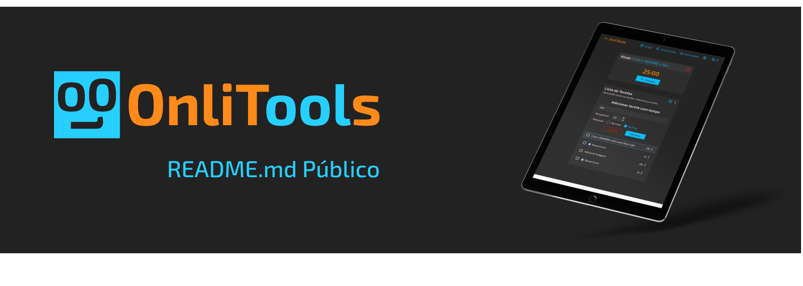
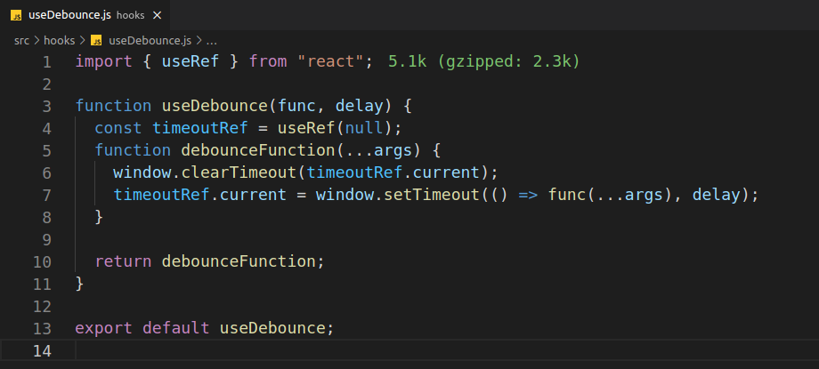

# onlitools_public

Sumário

1. Sobre
2. Principais Tecnologias
3. Funcionalidades
4. Programação
5. Ferramentas
6. Atualizações

## Sobre

Esse é um projeto pessoal que visa disponibilizar ferramentas para facilitar ou automatizar tarefas diárias, estudo, trabalho e etc. Elas são disponibilizadas de forma totalmente gratuita, para se tornarem acessíveis ao maior número de pessoas. Em breve, prentendo trazer mais ferramentas.

Qualquer dúvida, entre em contato pelo meu [LinkedIn](https://www.linkedin.com/in/lucas-levy-oliveira/) ou [Email](mailto:oliveiralucaslevy@gmail.com).

## Principais Tecnologias

- #### Next JS
  Framework React, que inclui diversas funcionalidades, permitindo a renderização de código React no lado servidor (SSR), o que contribui para melhorar o SEO de aplicações em React. Além disso, permite a criação de rotas, geração estática de sites (SSG), code-spliting.
- #### React JS
  Uma das tecnologias mais disseminadas para a construção de interfaces de usuário, usando JavaScript.
- #### Chakra UI
  É a biblioteca de componentes React usada para ajudar na construção de componentes personalizados. Também, permite a criação de temas, o que ajuda na coerência de estilos, cores, espaçamentos e etc, do site.
- #### React Beautiful DND
  É uma biblioteca que permite a criação de listas com a funcionalidade arrastar e soltar. Foi utilizada na ferramenta Pomodoro Online.
- #### Next i18next
  Permite a internacionalização de um site, de maneira mais facilitada. Foi utilizada a versão que permite a internacionalização no back-end, o que facilita o SEO do site e permite uma indexação melhorada. As linguagens suportadas até o momento são, Português, Inglês e Espanhol.
- #### firebase
  É uma solução oferecida pela Google, que possui várias funcionalidades, mas no momento estou utilizando apenas o Firestore Database, para armazenar os feedbacks e bugs relatados pelos usuários.
- #### Git
  O Git é uma ferramenta de versionamento de código, que permite organizar melhor a produção de software.
- #### GitHub
  Foi escolhido como plataforma de hospedagem de código.
- #### Vercel
  É a plataforma usada para a hospedagem do site.

## Funcionalidades

- #### Suporte de Idiomas
  São suportados três idiomas.
- #### Troca de Idioma
  A qualquer momento o usuário pode trocar o idioma do site.
- #### Caixa de Consentimento de Cookie
  O usuário pode escolher quais cookies que serão coletados, ou nenhum, se for da preferência dele.
- #### Gerenciamento de
- #### Feedback
  O usuário pode enviar feedbacks sobre as ferramentas e sobre o site.
- #### Reportar Bugs
  O usuário pode reportar um bug.

## Programação

- #### Context
  É uma forma de compartilhar um mesmo dado com muitos componentes React, facilitando a organização do código. Foi utilizado na ferramenta Pomodoro Online e no Tema, para compartilhar os dados.
- #### Reducers
  É utilizado para controlar lógicas de estado mais complexas, com muitos sub-valores, e/ou quando o valor anterior afeta um valor futuro. Foi usado na ferramenta Pomodoro Online.
- #### Indexed DB
  É uma API de armazenamento do JavaScript que armazena os dados no navegador do cliente. É capaz de armazenar grandes quantidades de dados e possui uma alta performance nas buscas. Foi utilizada no armazenamento das tasks e configurações do Pomodoro Online.
- #### Browser Notification
  É uma API JavaScript que permite exibir notificações na área de trabalho do usuário. Foi utilizada para exibir a notificação de conclusão de uma task.
- #### Service Workers
  É uma ferramenta que permite a melhoria da experência do usuário, em situações que ele está sem internet, em notificações no Smartphone, para trabalhar com Web Workers e outros. Foi utilizado no Pomodoro Online, para permitir as notificações em Smartphones.
- #### Theme
  É um provider fornecido pelo Chakra UI e outros frameorks ou bibliotecas UI, que permite a personalização de um tema. A partir dele, é possível padronizar cores, sombras, componentes e outros.
- #### Code Splitting
  É uma forma que o React usa para dividir o código de importes em outros arquivos, diminuindo o tamanho do arquivo principal.
- #### Hooks Personalizados
  Permite que a lógica de um determinado componente seja extraída para outro arquivo e possa ser utilizada em outros locais.
  
- #### Imports Dinâmicos
  O Next permite o import dinâmico de códigos e compnentes, que consiste em importar algo, apenas se o usuário fizer a requisição, deixando o site mais leve. Assim, só é carregado o básico e outras coisas que poderão não ser usadas, não são carregadas logo de cara.

## Ferramentas

1. #### [Pomodoro Online](https://www.onlitools.com/pt/tools/pomodoro-online)
   Ferramenta para gerênciamento de tempo que a usa a Técnica Pomodoro.
2. #### [Conversor de Comprimento](https://www.onlitools.com/pt/tools/length-converter)
   Ferramenta para a conversão de diversos tipos de medidas de comprimento.
3. #### [Contador de Caracteres](https://www.onlitools.com/pt/tools/character-counter)
   Ferramenta para contar caracteres, palavras, letras e parágrafos.

## Atualizações

...
